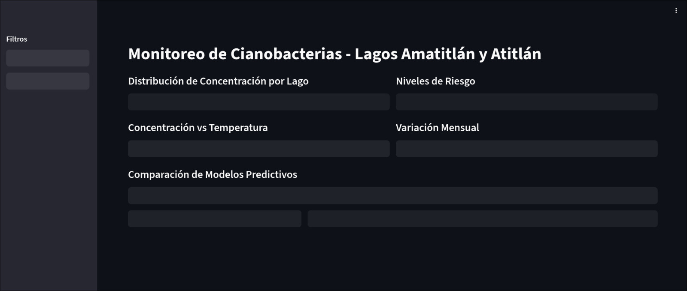

# Dashboard Interactivo de Monitoreo de Cianobacterias

## Selección de Herramienta
Streamlit fue seleccionado por su facilidad de implementación en Google Colab (según el propio streamlit podemos hacer uso de unos comandos para que sea sencillo de ver: [Ver documentacion de Streamlit](https://discuss.streamlit.io/t/how-to-launch-streamlit-app-from-google-colab-notebook/42399)), integración nativa con librerías de visualización como Plotly, y capacidad de crear dashboards interactivos con bastante facilidad.

## Paleta de Colores
Paleta principal:

Azul Oscuro: RGB(46, 80, 144) - Color primario para elementos estructurales y lago Amatitlán
Azul Medio: RGB(74, 123, 183) - Color secundario para lago Atitlán y elementos complementarios
Naranja: RGB(255, 140, 66) - Color de énfasis para datos importantes y alertas medias
Rojo: RGB(214, 69, 69) - Color para alertas de alto riesgo

### Justificación:
Similar a como lo usamos en el lab pasado, pero definimos colores con su respectivo RGB.
La paleta mantiene los colores azul y naranja del laboratorio anterior por consistencia visual. El azul representa el agua y transmite confianza. Mientras que el naranja provee contraste para destacar información crítica. Además, agregamos el rojo porque facilita la identificación rápida de niveles de riesgo.

## Planificación de Tareas

- Javier Chen
Diseño de wireframes y arquitectura del dashboard
Implementación de carga y procesamiento de datos
Desarrollo de 4 visualizaciones base
Configuración de filtros interactivos

- Gustavo Cruz
Implementación de 4 visualizaciones restantes
Desarrollo e integración de 3 modelos predictivos
Implementación de enlace entre visualizaciones
Refinamiento de UX y testing
Documentación y preparación de entrega

## Bosquejo

Se tiene en mente poner un filtro de lagos actualiza todas las visualizaciones, selección en scatter plot filtra datos en serie temporal, selección de modelos actualiza tabla comparativa y matrices de confusión

## Las 4 visualizaciones

Nuestra implementacion usa ngrok y requiere un token, es gratis de sacar pero toma unos minutos, por lo que inicialmente asi se ven las 4 visualizaciones:

