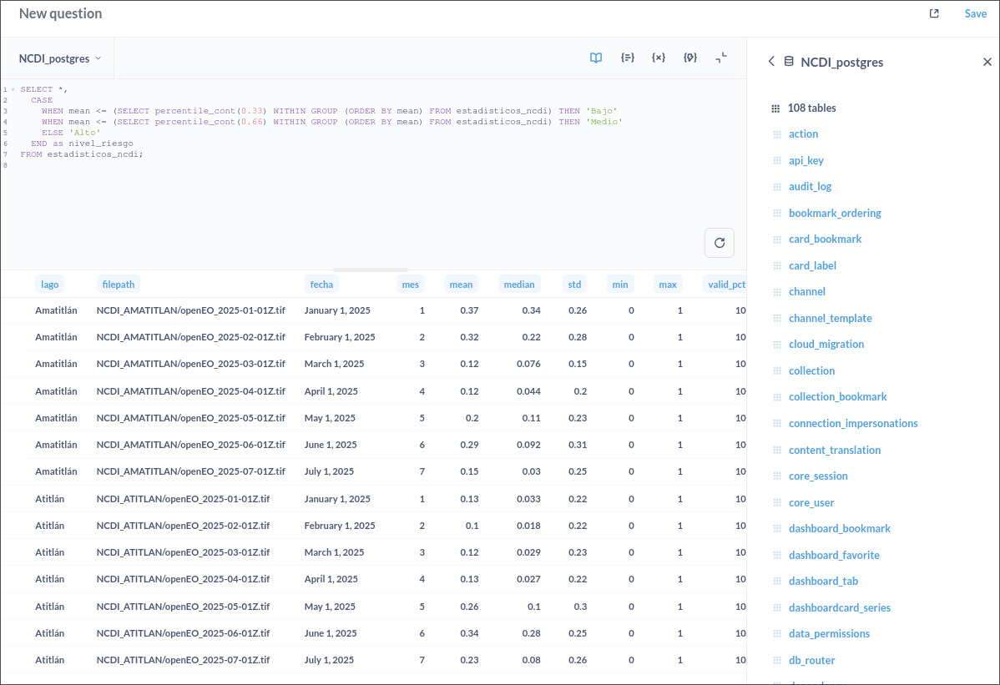
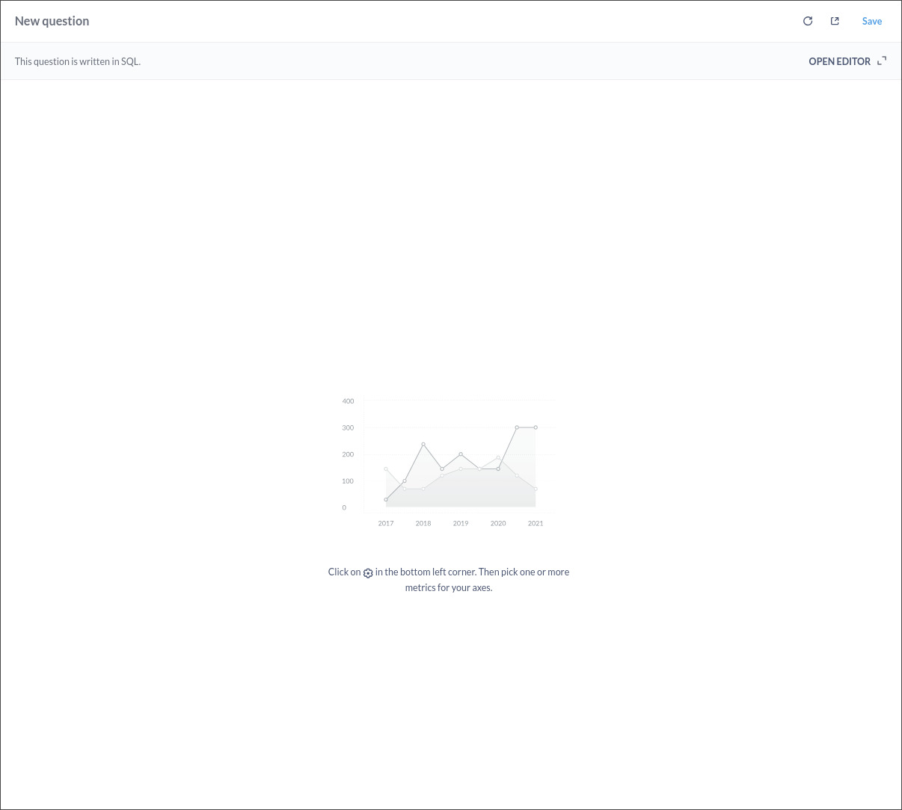

# Informe — Dashboard Cianobacterias
---
Javier Chen 22153
Gustavo Cruz 22779

---

Se presenta el avance del tablero interactivo para monitorear cianobacterias en los lagos Amatitlán y Atitlán. Se utilizó Metabase con Postgres en Docker como plataforma para construir dashboards interactivas. Los datos provienen de estadísticas extraídas de los GeoTIFF y se incluyeron las imágenes 1.jpg y 2.jpg como figuras ilustrativas. En esta entrega están implementadas dos pantallas operativas y diseñadas las cuatro pantallas requeridas por la asignación.

## Objetivos

Construir un tablero que permita explorar la evolución temporal y los puntos críticos de concentración de cianobacterias, con filtros por lago, fecha y nivel de riesgo, y con visualizaciones enlazadas que permitan pasar de una vista general al detalle.

## Hilo conductor

La historia que cuenta el tablero comienza con la visión general por lago y distribución de niveles, sigue con la evolución temporal para identificar tendencias mensuales, continúa con la localización de picos y rasters responsables, y finaliza con herramientas para profundizar y exportar datos para análisis externo.

## Paleta y accesibilidad

Tonos de azul para identificar los lagos, naranja para niveles medios y rojo para alertas. Fondo claro y texto oscuro para legibilidad. 

## Preparación de datos

Se generó un CSV con columnas lago, filepath, fecha, mes, mean, median, std, min, max, valid_pct a partir de los GeoTIFF. Se aplicó una transformación de tipo percentile stretch para evitar saturación y permitir ver variación mensual. El CSV fue importado a Postgres dentro del stack Docker que alimenta Metabase.
En el repositorio esta el programa que ayudo para esta tarea.

## Herramienta

Se eligió Metabase por su compatibilidad con Linux (no tenía otra opción, pero ya lo he utilizado anteriormente) y facilidad de despliegue en Docker. El entorno incluye un servicio Postgres para almacenar los estadísticos y Metabase para crear cards y dashboards con filtros y acciones de filtrado.

## Interactividad y experiencia de usuario

Se adjuntan capturas del tablero (se recomienda ver desde el [repositorio](https://github.com/JavierC22153/Laboratorios_DataScience/blob/Lab12/reporte.md))

 se incluye como captura de la visualización previa para la portada del informe. 
 se usa en la pantalla de picos como ejemplo del raster procesado correspondiente a una fecha crítica.

